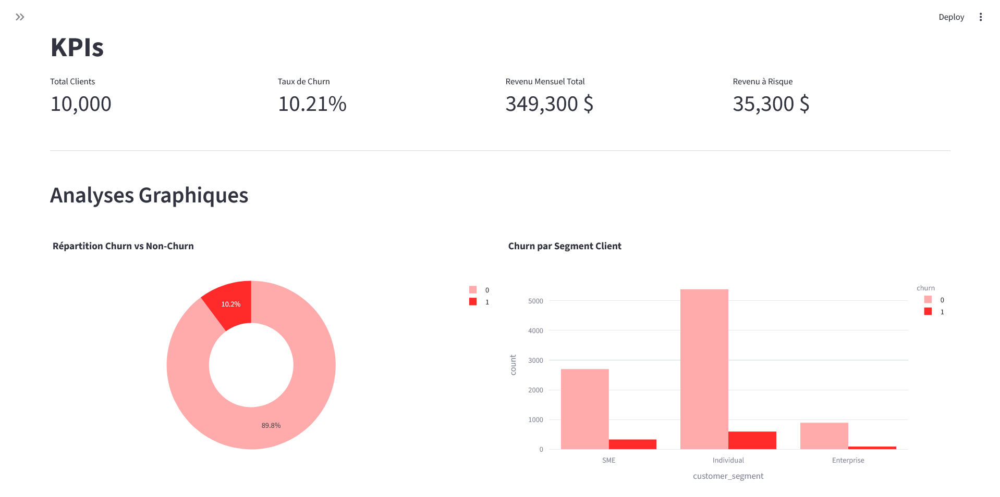
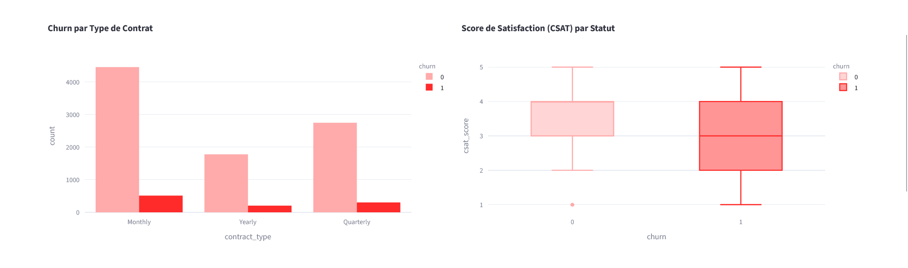
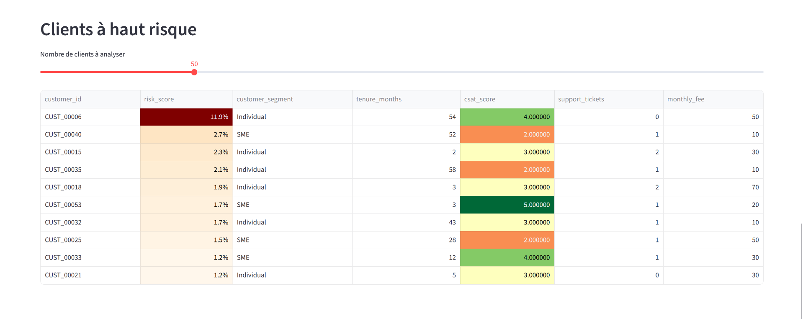
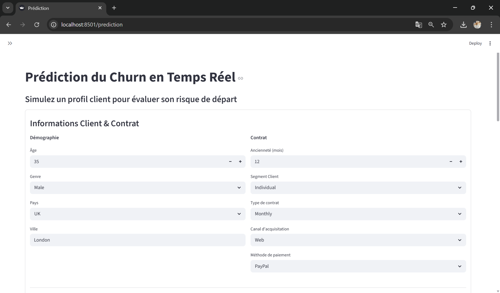
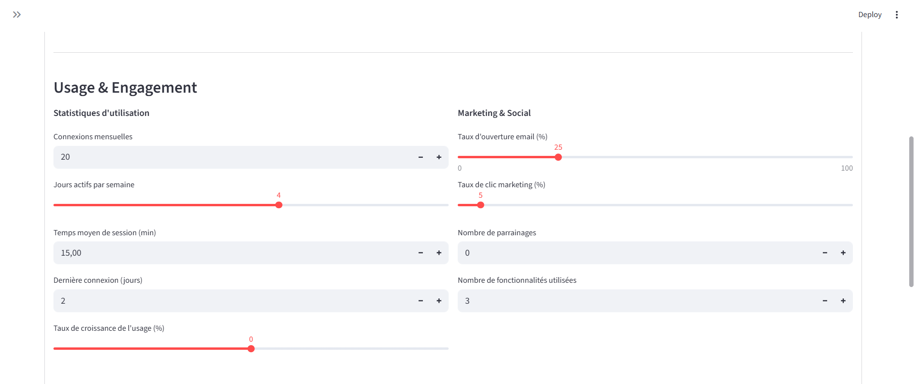
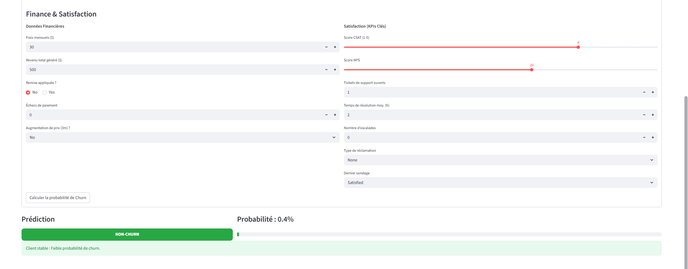
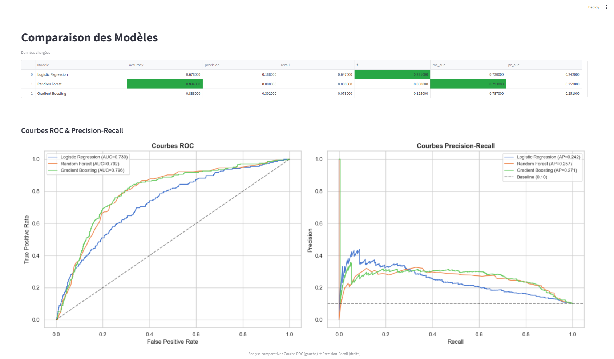
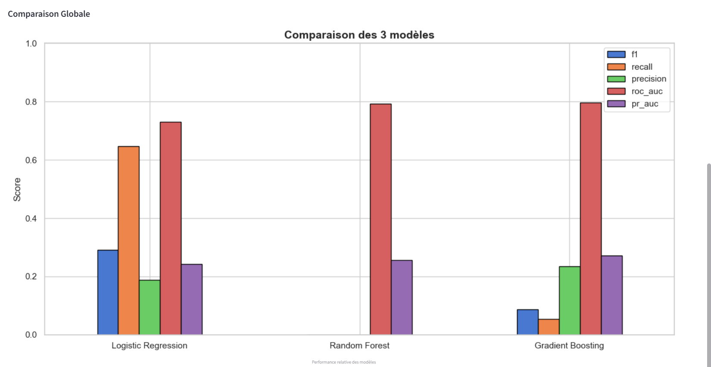
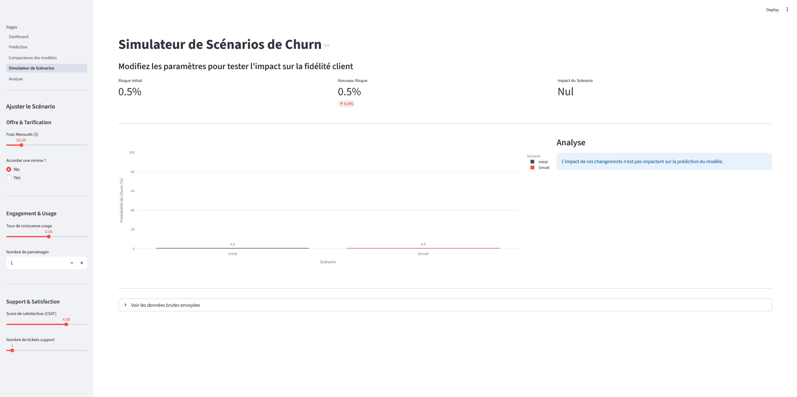
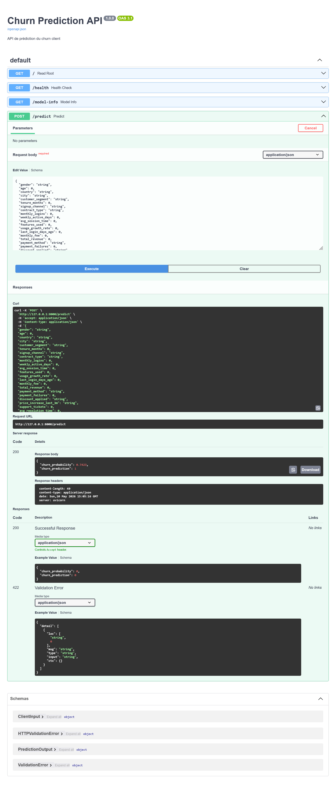

# Système Intelligent de Rétention Client


Système de prédiction du churn client basé sur le Machine Learning, avec API REST et dashboard interactif.

## Quickstart

Les artifacts (modèle, seuil, métriques, figures) sont déjà inclus dans le repo. `make train` n'est nécessaire que pour les régénérer.

### macOS / Linux

```bash
make install       # Crée le venv et installe les dépendances
make api           # Lance l'API FastAPI (localhost:8000)
make dashboard     # Lance le dashboard Streamlit (localhost:8501)
make train         # (optionnel) Ré-exécute les 3 notebooks et régénère les artifacts
```

### Windows

```cmd
make.bat install       # Crée le venv et installe les dépendances
make.bat api           # Lance l'API FastAPI (localhost:8000)
make.bat dashboard     # Lance le dashboard Streamlit (localhost:8501)
make.bat train         # (optionnel) Ré-exécute les 3 notebooks et régénère les artifacts
```

## Structure du projet

```
├── backend/
│   ├── api/              # API FastAPI (/predict, /health, /model-info)
│   ├── data/             # Module de preprocessing réutilisable
│   └── models/           # Script d'entraînement
├── frontend/
│   ├── streamlit_app.py  # Point d'entrée du dashboard
│   └── pages/            # Pages Streamlit (dashboard, prédiction, comparaison, simulation, analyse)
├── notebooks/
│   ├── 01_eda.ipynb              # Analyse exploratoire
│   ├── 02_preprocessing.ipynb    # Feature engineering
│   └── 03_modeling.ipynb         # Modélisation, évaluation, SHAP
├── reports/figures/      # Graphiques générés (ROC, SHAP, feature importance, etc.)
├── tests/                # Tests pytest (preprocessing, API, modeling)
├── artifacts/            # Modèle sérialisé, seuil, métriques (gitignored)
├── customer_churn.csv    # Dataset source (10 000 clients, 32 variables)
├── Makefile              # Commandes macOS / Linux
├── make.bat              # Commandes Windows
├── requirements.txt
└── pyproject.toml        # Config ruff + pytest
```

## Pipeline

1. **Preprocessing** — Pipeline sklearn (`ColumnTransformer`) avec feature engineering, split stratifié 80/20, pas de data leakage
2. **Modélisation** — 3 modèles comparés : Logistic Regression, Random Forest, Gradient Boosting
3. **Évaluation** — Métriques : Recall, F1, ROC-AUC, PR-AUC. Gestion du déséquilibre via SMOTE + ajustement du seuil
4. **Interprétabilité** — Feature Importance + SHAP
5. **API** — FastAPI avec endpoints `/predict`, `/health`, `/model-info`
6. **Dashboard** — Streamlit 5 pages : KPIs, prédiction temps réel, comparaison des modèles, simulateur de scénarios, analyse SHAP

## Modèle en production

- **Algorithme** : GradientBoostingClassifier (scikit-learn)
- **Seuil de décision** : 0.10 (optimisé pour maximiser le F1)
- **ROC-AUC** : 0.796
- **Hyperparamètres** : `n_estimators=500`, `learning_rate=0.05`, `max_depth=8`, `min_samples_leaf=20`, `subsample=0.8`

## Tests & CI

### macOS / Linux

```bash
make test          # Lance pytest
make lint          # Lance ruff
```

### Windows

```cmd
make.bat test      # Lance pytest
make.bat lint      # Lance ruff
```

CI GitHub Actions : ruff + pytest sur chaque push/PR vers main.

## Screenshots

### Dashboard — KPIs & graphiques





### Dashboard — Clients à haut risque



### Prédiction temps réel







### Comparaison des modèles





### Simulateur de scénarios



### API Swagger — /predict



## Équipe

Charrier Faustine, Hazami Sofia, Ladjoui Miriam, Tchitoula Louisan
